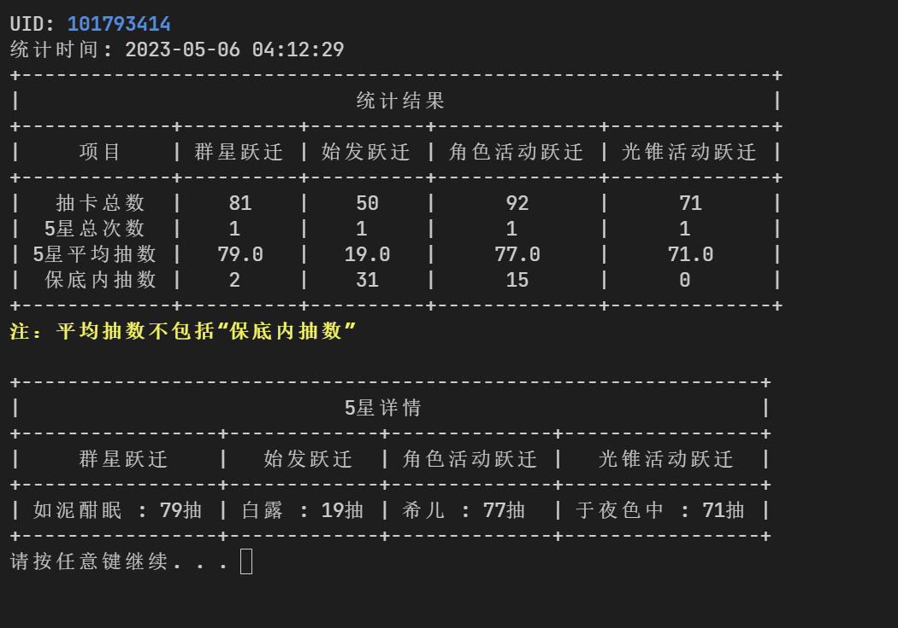

# 崩坏：星穹铁道小工具

[](https://github.com/cntvc/star-rail-tools/actions/workflows/linter.yml)
[](https://github.com/cntvc/star-rail-tools/commits/master)
[][latest_release]
[](https://github.com/cntvc/star-rail-tools/blob/main/LICENSE)


崩坏：星穹铁道小工具，可导出跃迁记录，目前仅支持 Windows 系统。

<p>
  
</p>


## 基本用法

下载源：
- [Github][latest_release]
- [制品库（国内推荐）][coding_latest]

### 1.导出跃迁记录

1. 设置账户：输入或选择星穹铁道账号 UID
2. 打开游戏，在**抽卡记录页面**选择历史记录并翻页
3. 切换到软件，依次选择菜单 **导出抽卡数据** -> **使用游戏缓存导出**
4. 完成导出后，根据提示查看抽卡报告

### 2.导入或合并抽卡数据

1. 设置账户：输入或选择星穹铁道账号 UID
2. 将需要导入或合并的数据放入 `merge` 文件夹内，可一次放入多个文件。支持 SRGF[^1] 格式以及软件自带格式的 json 文件
3. 切换到软件，选择菜单 **导入或合并数据**

<details>
  <summary>点击查看 <b>数据目录结构</b></summary>
  <p>

```cmd
  StarRailTools_1.0.0.exe # 主程序文件
  StarRailTools # 软件数据目录
  +---101793414 # 账号 101793414 的抽卡数据
  |       GachaAnalyze_101793414.json # 抽卡分析结果
  |       GachaLog_101793414.json # 抽卡原始数据
  |       GachaLog_101793414.xlsx # 导出的XLSX文件
  |       UserProfile_101793414.json # 账号信息
  |
  +---merge # 用于读取需要导入或合并的数据文件
  |
  +---config
  |       settings.json # 软件设置（如果没有进行过设置则不存在
  |
  \---log
          log_2023_05.log # 日志文件
```

 </p>
</details>


## 参与贡献

非常欢迎您参与项目贡献
- 如果您有新的想法或功能建议，请创建 Issue 进行讨论
- 如果您发现了软件 Bug 或者希望对文档进行更新，可直接创建 PR

更多详情请参阅 [CONTRIBUTING](.github/CONTRIBUTING.md)


## 鸣谢

- 导出 Execl 代码参考 [**genshin-gacha-export**](https://github.com/sunfkny/genshin-gacha-export)
- 适配国际服的代码参考 [**star-rail-warp-export**](https://github.com/biuuu/star-rail-warp-export)

[^1]: SRGF: 星穹铁道抽卡记录标准格式，可用于在不同软件间迁移数据，详情请见 [SRGF 官网][SRGF]


[latest_release]: https://github.com/cntvc/star-rail-tools/releases/latest
[coding_latest]: https://cntvc.coding.net/public-artifacts/star-rail-tools/releases/packages

[SRGF]: https://uigf.org/zh/standards/SRGF.html
