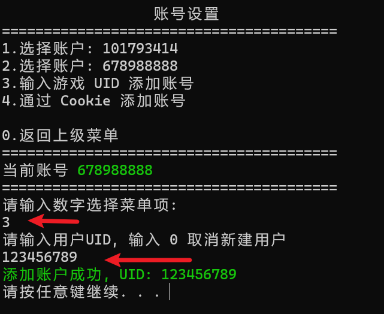

中文 | [English][en_us]

# 崩坏：星穹铁道小工具

[](https://github.com/cntvc/star-rail-tools/actions/workflows/test.yml)
[](https://github.com/cntvc/star-rail-tools/commits/main)
[][latest_release]
[](https://github.com/cntvc/star-rail-tools/blob/main/LICENSE)


崩坏：星穹铁道小工具，可导出跃迁记录和开拓月历

<p>
  
</p>


## 基本用法

下载源：
- [Github][latest_release] 有两个发行版
  - zip 后缀: 文件夹压缩版，相对于单文件版本启动较快
  - exe 后缀: 单文件版本
- [制品库][coding_latest]（国内下载更快，且只包有单文件版本


### 0. 添加账号

1. 手动输入游戏 UID 添加账号

    依次输入数字选择菜单项 "账号设置" -> "输入游戏 UID 添加账号"

    <details>
    <summary>输入 UID 步骤示例</summary>
    <p>

    <p>
      
    </p>

    </p>
    </details>

2. 添加或更新账号 Cookie

    **注意：Cookie 是非常重要的账号凭据，请误泄漏以免导致可能的账号安全问题**

    首先登陆[米哈游通行证](https://user.mihoyo.com/)页面，打开F12，选择控制台，粘贴以下代码，在弹出的对话框复制 cookie
    ```javascript
    javascript:(function(){prompt(document.domain,document.cookie)})();
    ```

    然后依次输入数字选择菜单项 "账号设置" -> "通过 Cookie 添加账号"，这将自动读取剪切板数据并获得相关游戏账号

    <details>
      <summary>Cookie 获取示例</summary>
    <p>

    <p>
      
    </p>

    </p>
    </details>


### 1. 跃迁记录

#### (1) 跃迁记录导出

1. 设置账号：选择或添加星穹铁道账号 UID
2. 打开游戏，在 "抽卡记录页面" 选择历史记录并翻页
3. 切换到软件，依次选择菜单项 "跃迁记录" -> "通过游戏缓存导出"
4. 完成导出后，会自动显示当前抽卡分析结果

#### (2) 导入抽卡数据

1. 设置账号：输入或选择星穹铁道账号 UID
2. 将需要导入的数据放入 "Import" 文件夹内，可一次放入多个文件。支持 [SRGF][SRGF] 格式的 json 文件
3. 切换到软件，依次选择菜单项 "跃迁记录" -> "导入跃迁记录"
4. 根据提示导入成功后，需要手动选择菜单项 "查看分析结果"

### 2. 开拓月历

#### 开拓月历导出

1. 添加或更新账号 Cookie
2. 选择需要操作的 UID
3. 依次选择菜单项 "开拓月历" -> "获取开拓月历" 功能，等待结果显示


<details>
  <summary>点击查看 数据目录结构</summary>
  <p>

```cmd
  StarRailTools_1.0.0.exe # 主程序文件
  StarRailTools # 软件数据目录
  ├── 101793414 # 账号 101793414 导出数据的目录
  │   ├── GachaLog_101793414.xlsx
  │   └── GachaLog_SRGF_101793414.json
  ├── AppData # 软件运行数据
  │   ├── config
  │   │   └── settings.json
  │   ├── data
  │   │   └── star_rail.db
  │   ├── log
  │   │   └── log_2023_08.log
  │   └── temp
  │       └── GachaAnalyze_101793414.json
  └── Import # 读取导入数据的目录
```

 </p>
</details>


## 参与贡献

非常欢迎您参与项目贡献
- 如果您有新的想法或功能建议，请创建 Issue 进行讨论
- 如果您发现了软件 Bug 或者希望对文档进行更新，可直接创建 PR

更多详情请参阅 [CONTRIBUTING](.github/CONTRIBUTING.md)


## 鸣谢

- 导出 Execl 代码参考 [**genshin-gacha-export**](https://github.com/sunfkny/genshin-gacha-export)
- 适配国际服的代码参考 [**star-rail-warp-export**](https://github.com/biuuu/star-rail-warp-export)

### JetBrains 开发工具
特别感谢 [**JetBrains**](https://jb.gg/OpenSourceSupport) 为开源项目提供的开发许可证


[latest_release]: https://github.com/cntvc/star-rail-tools/releases/latest
[coding_latest]: https://cntvc.coding.net/public-artifacts/star-rail-tools/releases/packages

[SRGF]: https://uigf.org/zh/standards/SRGF.html
[en_us]: docs/README_EN.md
