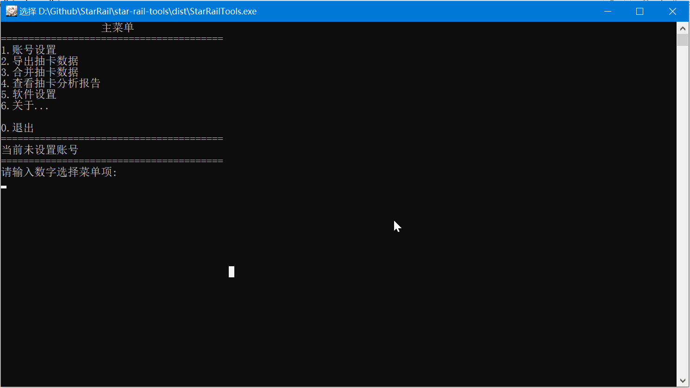
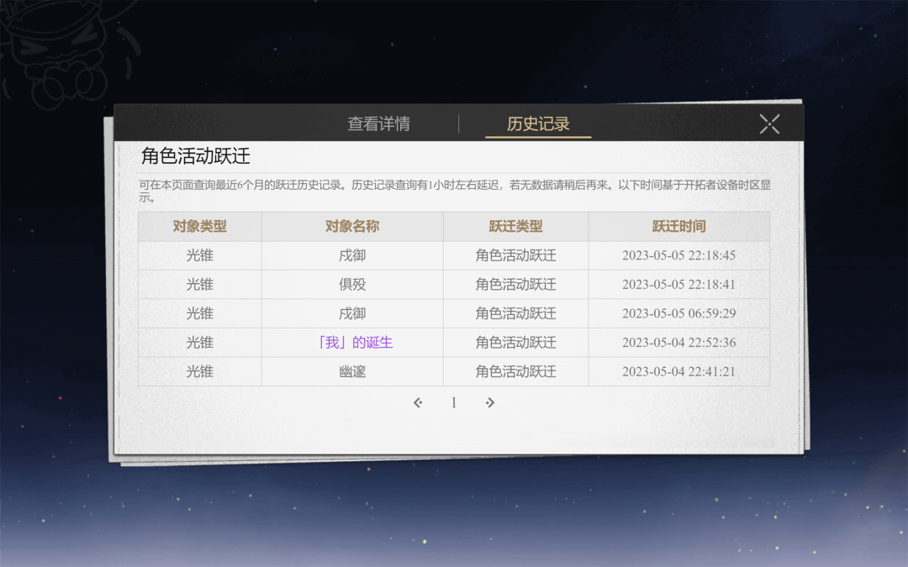

# 崩坏·星穹铁道跃迁记录导出工具

# 使用方式

在 Github [下载页面](https://github.com/cntvc/star-rail-wish-tools/releases/latest) 下载exe文件，双击即可使用

1. 设置账户：选择或输入需要导出的账号 UID
2. 打开游戏，在**抽卡记录页面**选择历史记录并翻页
3. 切换到软件，依次选择菜单 **导出抽卡数据** -> **使用游戏缓存导出**

  
点击查看 <b>抽卡记录页面</b>

  

  
 

**抽卡结果分析展示**

  

# 鸣谢
- 项目由 [**Genshin_Impact_Tools**](https://github.com/cntvc/Genshin-Impact-Tools) 修改而来
- 生成 XLSX 文件代码参考了项目 [**genshin-gacha-export**](https://github.com/sunfkny/genshin-gacha-export/blob/main/writeXLSX.py)
