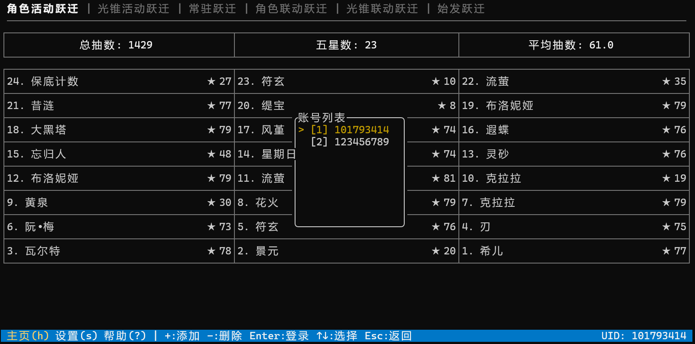
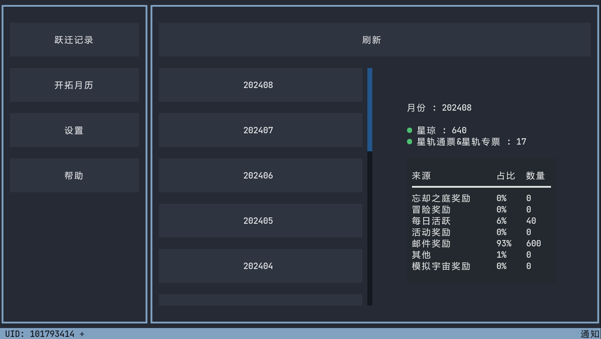
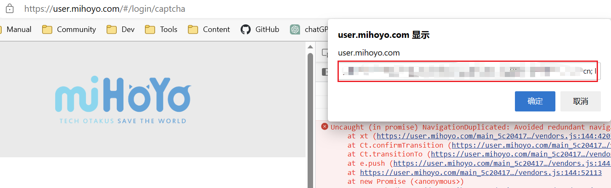

中文 | [English][en_us]

# 崩坏：星穹铁道小工具

[](https://github.com/cntvc/star-rail-tools/actions/workflows/test.yml)
[](https://github.com/cntvc/star-rail-tools/commits/main)
[][latest_release]
[](https://github.com/cntvc/star-rail-tools/blob/main/LICENSE)


崩坏：星穹铁道小工具，可导出跃迁记录和开拓月历


 | 
|:------------: | :-------------|

## 基本使用


### 添加或更新账号 Cookie

  > [!WARNING]
  > **注意：Cookie 是非常重要的账号凭据，请勿泄漏以免导致可能的账号安全问题**


  首先登陆[**米哈游通行证**](https://user.mihoyo.com/)（国际服用户登陆[**HoYoLAB**](https://account.hoyoverse.com/)）页面，点击F12按键，选择控制台，粘贴以下代码，在弹出的对话框复制 Cookie


  ```javascript
  javascript:(function(){prompt(document.domain,document.cookie)})();
  ```

  然后点击"读取 Cookie"按钮，这将自动读取剪切板数据并进行解析

  <details>
    <summary>Cookie 获取示例</summary>
  <p>

  <p>
    
  </p>

  </p>
  </details>

### 数据迁移
  本软件为 [UIGF](https://uigf.org) 组织成员，支持 `SRGF` 格式的跃迁记录文件导入导出

  **导入 SRGF 格式数据**:
  将需要导入的数据文件放入 "Import" 文件夹内，可一次放入多个文件，点击"导入数据"按钮即可


<details>
  <summary>点击查看 数据目录结构</summary>
  <p>

```cmd
  StarRailTools_1.0.0.exe # 主程序文件
  StarRailTools # 软件数据目录
  ├── 101793414 # 账号 101793414 导出数据的目录
  │   ├── GachaLog_101793414.xlsx
  │   └── GachaLog_SRGF_101793414.json
  ├── AppData # 软件运行数据
  │   ├── config
  │   │   └── settings.json
  │   ├── data
  │   │   └── star_rail.db
  │   ├── log
  │   │   └── log_2023_08.log
  │   └── temp
  │       └── GachaAnalyze_101793414.json
  └── Import # 读取导入数据的目录
```

 </p>
</details>


## 参与贡献

非常欢迎您参与项目贡献
- 如果您有新的想法或功能建议，请创建 Issue 进行讨论
- 如果您发现了软件 Bug 或者希望对文档进行更新，可直接创建 PR

更多详情请参阅 [CONTRIBUTING](.github/CONTRIBUTING.md)


## 鸣谢

- 早期开发的参考项目 [**genshin-gacha-export**](https://github.com/sunfkny/genshin-gacha-export)
- 分页查询模块 [**genshin.py**](https://github.com/thesadru/genshin.py)

### JetBrains 开发工具
特别感谢 [**JetBrains**](https://jb.gg/OpenSourceSupport) 为开源项目提供的开发许可证


[latest_release]: https://github.com/cntvc/star-rail-tools/releases/latest
[coding_latest]: https://cntvc.coding.net/public-artifacts/star-rail-tools/releases/packages
[en_us]: docs/README_EN.md
