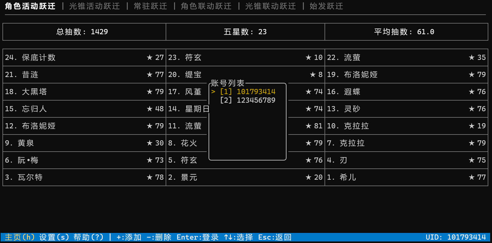

# 崩坏：星穹铁道跃迁记录统计工具

[](https://ratatui.rs/)
[](https://github.com/cntvc/star-rail-tools/commits/main)
[](https://github.com/cntvc/star-rail-tools/releases/latest)
[](./LICENSE)

崩坏：星穹铁道小工具，提供跃迁记录导入、导出、统计和可视化功能



## 基本使用

### 获取跃迁记录

1. 打开游戏的跃迁记录历史页面
2. 在软件依次选择菜单 **更新** -> **增量更新**

### 数据导入

软件支持导入 `SRGF/UIGFv4`[^1] 格式数据

将需要导入的数据文件放入 `Import` 文件夹内，可一次放入多个文件，在文件列表中选择需要导入的文件即可

<details>
  <summary>点击查看 数据目录结构</summary>
  <p>

```cmd
  StarRailTools_1.0.0.exe # 主程序文件
  StarRailTools # 软件数据目录
  ├── 101793414 # 账号 101793414 导出数据的目录
  │   └── GachaRecord_UIGF_101793414.json
  ├── Cache
  ├── Database
  │   └── star-rail-tools.db
  ├── Logs
  │   └── star-rail-tools-20250225-010221.log
  └── Import # 读取导入数据的目录
```

  </p>
</details>

## 参与贡献

非常欢迎您参与项目贡献

- 如果您希望对文档进行更新，可直接创建 PR
- 发现软件 Bug、提出新想法或功能建议等其他任何更改，均请先创建 Issue 进行讨论

更多详情请参阅 [CONTRIBUTING](.github/CONTRIBUTING.md)

## 鸣谢

- 本项目早期开发参考了：[**genshin-gacha-export**](https://github.com/sunfkny/genshin-gacha-export)

[^1]: `SRGF/UIGFv4` 格式为 UIGF 组织制定的数据交换格式，详情请访问 [UIGF](https://uigf.org) 官网
