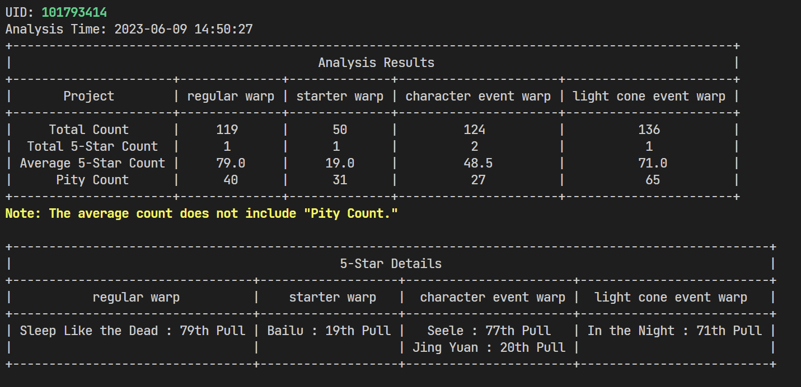

[中文][zh_cn] | English

# Honkai: Star Rail Tools

[](https://github.com/cntvc/star-rail-tools/actions/workflows/test.yml)
[](https://github.com/cntvc/star-rail-tools/commits/main)
[][latest_release]
[](https://github.com/cntvc/star-rail-tools/blob/main/LICENSE)


Honkai: Star Rail Tools, a small utility for exporting gacha records and exporting calendar.

<p>
  
</p>

## Basic Usage

### Download Sources

- [Github][latest_release]: has two releases
  - zip suffix: folder compressed version, faster startup compared to the single-file version
  - exe suffix: single-file version
- [Artifact Repository][coding_latest] (faster download in China, includes only the single-file version)

### Add or update account cookies.

  **Note: Cookies are crucial account credentials. Do not disclose them to avoid potential account security issues.**

  Firstly, log in to [MiHoYo](https://user.mihoyo.com/) (International server users log in to [hoyolab](https://www.hoyolab.com/)). Press F12, select the console, paste the following code, copy the cookie from the dialog that appears.

  ```javascript
  javascript:(function(){prompt(document.domain,document.cookie)})();
  ```

  Then click the "Read Cookie" button, which will automatically read clipboard data and parse it.

  <details>
    <summary>Cookie Retrieval Example</summary>
  <p>

  <p>
    
  </p>

  </p>
  </details>

### Data Migration
This software is a member of the [UIGF](https://uigf.org) organization, supports import and export of [SRGF](https://uigf.org/en/standards/SRGF.html) format data.

Importing SRGF format data:
Place the data files you want to import into the "Import" folder. You can add multiple files at once. Click the "Import Data" button to proceed.

<details>
  <summary>Click to view Data Directory Structure</summary>
  <p>

```cmd
  StarRailTools_1.0.0.exe # Main program file
  StarRailTools # Software data directory
  ├── 101793414 # Exported data for account 101793414
  │   ├── GachaLog_101793414.xlsx
  │   └── GachaLog_SRGF_101793414.json
  ├── AppData # Software runtime data
  │   ├── config
  │   │   └── settings.json
  │   ├── data
  │   │   └── star_rail.db
  │   ├── log
  │   │   └── log_2023_08.log
  │   └── temp
  │       └── GachaAnalyze_101793414.json
  └── Import # Directory for loding import data
```

 </p>
</details>


## Contributing
Your contributions to this project are highly appreciated.

- If you have new ideas or feature suggestions, please create a issue.
- If you find any bugs in the software or would like to update the documentation, feel free to create a pull request.

For more details, please refer to [CONTRIBUTING](../.github/CONTRIBUTING.md)


## Acknowledgments

- Reference project for early development : [**genshin-gacha-export**](https://github.com/sunfkny/genshin-gacha-export)
- [Pagination module](../star_rail/core/paginator/) : [**genshin.py**](https://github.com/thesadru/genshin.py)

### JetBrains Development Tools
Thanks to JetBrains for providing development licenses for open-source projects.


[latest_release]: https://github.com/cntvc/star-rail-tools/releases/latest
[coding_latest]: https://cntvc.coding.net/public-artifacts/star-rail-tools/releases/packages
[zh_cn]: ../README.md
